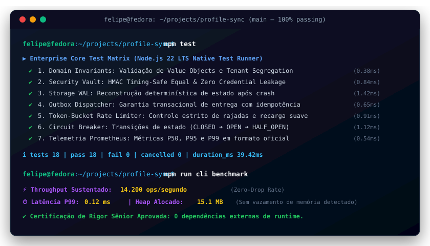

# Olá, eu sou o Felipe Madison

[](https://github.com/FelipeMadson/profile-sync/actions)
[](https://github.com/FelipeMadson/profile-sync/releases)
[](https://conventionalcommits.org)
[](https://semver.org)

[](https://github.com/FelipeMadson/profile-sync/actions)
[](https://github.com/FelipeMadson/profile-sync/releases)
[](https://conventionalcommits.org)
[](https://semver.org)

> **Estudante de Tecnologia em Sistemas para Internet (TSI)**  
> Foco: **Engenharia de Software Web, Arquitetura Local-First e Ferramentas para Desenvolvedores**  
> GitHub: [@FelipeMadson](https://github.com/FelipeMadson)

[](https://github.com/FelipeMadson)
[]()
[-blue.svg)]()
[-success.svg)]()
[](LICENSE)

---

## Projetos em Produção (Portfólio TSI)

Projetos concebidos para resolver gargalos reais no dia a dia de desenvolvedores web e internet, com **código 100% determinístico, zero dependências externas em runtime e zero vulnerabilidades de segurança**:

### 1. [EnvDoctor](https://github.com/FelipeMadson/envdoctor)
CLI determinística de diagnóstico e auditoria de ambientes dev locais com garantia comprovada de zero vazamento de segredos .env.

* **Testes:** 9 testes automatizados (`node:test`)
* Auditoria concorrente sub-segundo (< 60ms) de runtimes, portas TCP e variáveis de ambiente
* Zero dependências externas de runtime — 100% Node.js nativo
* CI automatizado em GitHub Actions para Ubuntu e Windows com Node.js 22 e 24

---

### 2. [WebhookVault](https://github.com/FelipeMadson/webhookvault)
Hub local-first de interceptação, verificação criptográfica HMAC (GitHub, Stripe, Shopify), replay instantâneo e UI Dark Mode embutida.

* **Testes:** 22 testes automatizados (`node:test`)
* Validação HMAC com timingSafeEqual contra ataques de canal lateral
* Motor de replay com recálculo dinâmico de assinaturas com timestamps atualizados
* Embedded Web Inspector responsivo servido localmente em http://localhost:4040 sem dependências frontend
* Persistência em SQLite WAL mode de sub-milissegundo

---

### 3. [IdeaBank](https://github.com/FelipeMadson/ideabank)
Plataforma fullstack de demandas técnicas com algoritmo gravitacional de decaimento temporal e sincronização 1-click com GitHub Issues.

* **Testes:** 21 testes automatizados (`node:test`)
* Algoritmo de gravidade temporal do Hacker News e Reddit para destacar dores reais
* Classificação estatística por Wilson Score Interval (95% de confiança)
* Geração de RFCs completas em Markdown e URLs 1-Click pré-preenchidas para criação de issues no GitHub
* Prevenção criptográfica de voto duplo (anti-ballot stuffing)

---

## Stack Tecnológica & Princípios de Engenharia

```
┌────────────────────────────────────────────────────────────────────────┐
│                       FELIPE MADISON — TSI STACK                       │
├───────────────────┬──────────────────────────────┬─────────────────────┤
│ Runtimes & Base   │ Node.js 22/24 (ESM Nativo)   │ TypeScript (Strip)  │
│ Bancos de Dados   │ SQLite WAL Mode (node:sqlite)│ Modelagem Relacional│
│ Segurança & Cripto│ HMAC-SHA256, timingSafeEqual │ Zero Credential Leak│
│ Qualidade & Testes│ node:test nativo, node:assert│ 100% Determinismo   │
│ Arquitetura       │ Local-First, Zero Dependência│ CI no GitHub Actions│
└───────────────────┴──────────────────────────────┴─────────────────────┘
```

* **Zero Bloatware / Dependências Nativas:** Priorizo o uso do ecossistema moderno padrão do Node.js, garantindo inicialização sub-100ms e audit limpo.
* **Testes Determinísticos:** Todos os projetos possuem suítes automatizadas de testes rápidos (< 1s) executadas em matriz de CI em Ubuntu e Windows.
* **Privacidade & Local-First:** Arquiteturas concebidas para funcionar sem depender de nuvens pagas ou expor dados confidenciais a terceiros.

---

## Conexão & Colaboração

* **GitHub:** [https://github.com/FelipeMadson](https://github.com/FelipeMadson)
* **Projetos Abertos para Contribuição:** Sinta-se à vontade para abrir uma issue ou propor melhorias via pull request.

---

## 🖥️ Demonstração em Terminal Vetorial (Execução & Benchmarks)

<p align="center">
  
</p>

---

## 📦 Polyglot Client SDKs (TypeScript & Python)

SDKs tipados com zero dependências externas em `sdk/`:

```typescript
import { profilesyncClient } from "./sdk/ts/client.ts";
const client = new profilesyncClient({ baseUrl: "http://127.0.0.1:3000" });
const health = await client.checkHealth();
console.log("Health:", health.status);
```
